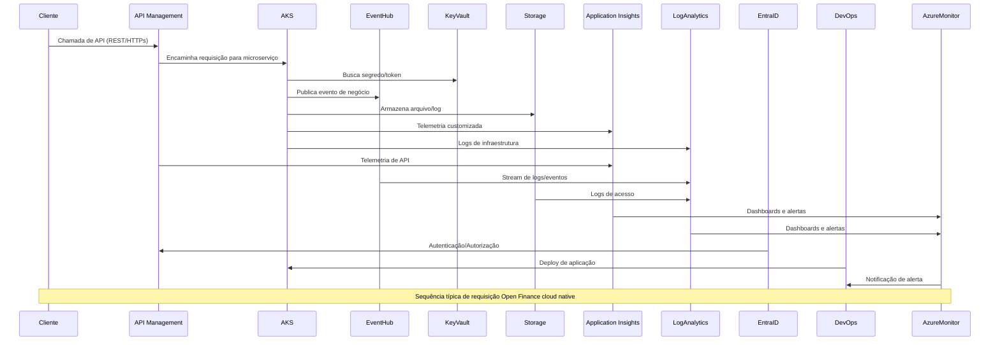
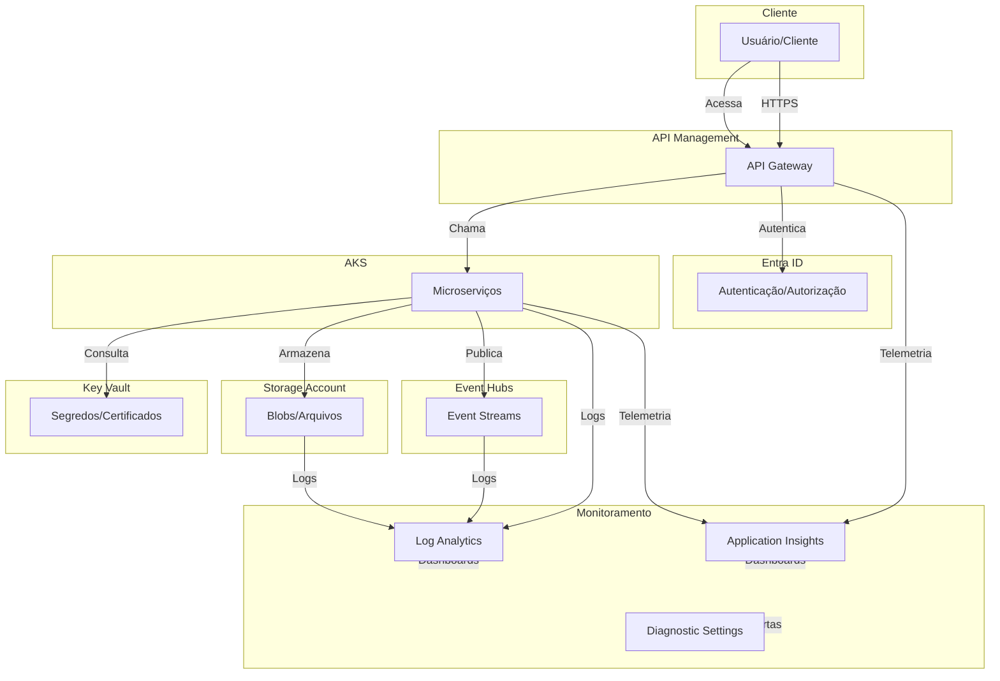

# JJ Fintech - Laboratório Open Finance no Azure

## Visão Geral

Este repositório provê uma solução cloud native para Open Finance/Open Banking, baseada no Azure CAF (Cloud Adoption Framework), com foco em segurança, governança, automação e observabilidade, adequada para clientes do setor financeiro.

### Componentes Provisionados
- Azure Kubernetes Service (AKS)
- API Management (APIM)
- Azure Key Vault
- Storage Account
- Event Hubs
- Application Insights
- Log Analytics Workspace
- Diagnostic Settings
- Virtual Network (VNet)
- Private Endpoints (opcional)

### Estrutura de Pastas do Projeto

```
├── main.tf
├── provider.tf
├── variables.tf
├── outputs.tf
├── terraform.tfvars
├── module/
│   ├── core/
│   │   ├── vnet/
│   │   │   ├── main.tf
│   │   │   ├── outputs.tf
│   │   │   └── variables.tf
│   │   ├── storage/
│   │   │   ├── main.tf
│   │   │   ├── outputs.tf
│   │   │   └── variables.tf
│   │   ├── keyvault/
│   │   │   ├── main.tf
│   │   │   ├── outputs.tf
│   │   │   └── variables.tf
│   │   ├── aks/
│   │   │   ├── main.tf
│   │   │   ├── outputs.tf
│   │   │   └── variables.tf
│   │   ├── apim/
│   │   │   ├── main.tf
│   │   │   ├── outputs.tf
│   │   │   └── variables.tf
│   │   ├── eventhub/
│   │   │   ├── main.tf
│   │   │   ├── outputs.tf
│   │   │   └── variables.tf
│   ├── monitor_analytics/
│   │   ├── log_analytics_workspace/
│   │   │   ├── main.tf
│   │   │   ├── outputs.tf
│   │   │   └── variables.tf
│   │   ├── application_insights/
│   │   │   ├── main.tf
│   │   │   ├── outputs.tf
│   │   │   └── variables.tf
│   │   ├── diagnostic_settings/
│   │   │   ├── main.tf
│   │   │   ├── outputs.tf
│   │   │   └── variables.tf
```

## Arquitetura e Práticas CAF

- **CAF Naming**: Todos os recursos seguem o padrão `{prefixo-recurso}-{workload}-{ambiente}-{região}-{instância}` para rastreabilidade e governança.
- **Segurança**: Key Vault com acesso privado, RBAC, e políticas de acesso restritivas. Storage e Event Hub com Private Endpoints e acesso público desabilitado.
- **Observabilidade**: Application Insights, Log Analytics e Diagnostic Settings integrados a todos os recursos críticos.
- **Automação**: Infraestrutura como código (IaC) com Terraform, pipelines DevOps recomendados.
- **Resiliência**: Deploy em múltiplas zonas, backup e retenção configurados.
- **Compliance**: Atende requisitos de LGPD, Open Finance Brasil e Azure Security Benchmark.

## Requisitos Funcionais
- Provisionar ambiente seguro e escalável para workloads Open Finance.
- Expor APIs via API Management, com autenticação EntraID (Azure AD).
- Orquestrar microserviços em AKS, com integração a Event Hub, Storage e Key Vault.
- Monitorar aplicações e infraestrutura em tempo real.
- Garantir logs centralizados e alertas automáticos.

## Requisitos Não Funcionais
- Alta disponibilidade e escalabilidade automática.
- Segregação de ambientes (dev, stage, prod) via tfvars.
- Naming convention e tagging para governança.
- Deploy automatizado e idempotente.
- Observabilidade e rastreabilidade ponta a ponta.
- Conformidade com padrões regulatórios financeiros.

## Diagrama de Sequência (Cloud Native Open Finance)



## Diagrama de Arquitetura (Cloud Native Open Finance)



## Como Usar

1. **Clonar o repositório e configurar variáveis** (ver exemplos em `terraform.tfvars`).
2. **Executar**:
   - `terraform init`
   - `terraform validate`
   - `terraform plan`
   - `terraform apply`
3. **Acessar outputs** para URLs, nomes e credenciais dos recursos provisionados.
4. **Configurar acesso ao AKS** e demais integrações conforme instruções.

## Dicas CAF e Operação
- Use sempre variáveis e outputs explícitos para rastreabilidade.
- Mantenha o versionamento do código e pipelines de CI/CD para automação.
- Utilize tags e naming para facilitar auditoria e billing.
- Habilite logs e alertas em todos os recursos críticos.
- Restrinja acessos via RBAC e políticas de rede.
- Documente exceções e customizações no próprio repositório.

## Troubleshooting e Melhores Práticas
- Consulte logs no Log Analytics e Application Insights para troubleshooting.
- Use `terraform import` para recursos já existentes.
- Para erros de nome duplicado, utilize sufixos randômicos ou ajuste o `project_name`.
- Siga sempre as recomendações do Azure Well-Architected Framework.

---

Para dúvidas técnicas, consulte este README, a documentação oficial do Azure CAF e os links de referência ao final do arquivo.